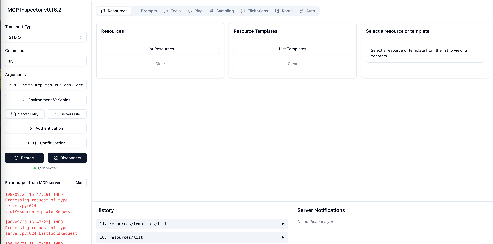

## RAG 检索增强生成系统

https://www.databricks.com/glossary/retrieval-augmented-generation-rag

RAG解决LLM知识的过时、以及专业知识的匮乏的问题，通过获取外部知识来增强LLM本身的知识。

## 什么是RAG

说了这么多，下面我们来介绍一下什么是 RAG 。

RAG 是检索增强生成（Retrieval Augmented Generation ）的简称，它为大语言模型 (LLMs) 提供了从数据源检索信息的能力，并以此为基础生成回答。简而言之，RAG 结合了信息检索技术和大语言模型的提示功能，即模型根据搜索算法找到的信息作为上下文来查询回答问题。无论是查询还是检索的上下文，都会被整合到发给大语言模型的提示中。

完整的 RAG 应用流程主要包含两个阶段：
* 数据准备阶段：（A）数据提取--> （B）分块（Chunking）--> （C）向量化（embedding）--> （D）数据入库
* 检索生成阶段：（1）问题向量化--> （2）根据问题查询匹配数据--> （3）获取索引数据 --> （4）将数据注入Prompt--> （5）LLM生成答案

更多可以参考 local_rag.ipynb [本地RAG样例](https://www.langchain.com.cn/docs/tutorials/local_rag/)

Retrieval augmented generation, or RAG, is an architectural approach that can improve the efficacy of large language model (LLM) applications by leveraging custom data. This is done by retrieving data/documents relevant to a question or task and providing them as context for the LLM. RAG has shown success in support chatbots and Q&A systems that need to maintain up-to-date information or access domain-specific knowledge.


# MCP (Model Context Protocol) 模型和应用程序交互的协议

> 参考教程：https://github.com/liaokongVFX/MCP-Chinese-Getting-Started-Guide?tab=readme-ov-file

MCP  focuses on standardizing LLM actions through tool and API integration. 

**MCP强调的是LLM和外界的交互，通过MCP协议，让LLM可以通过Agent执行各种外部动作、和外部系统进行联动。**

模型上下文协议（MCP）是一个创新的开源协议，它重新定义了大语言模型（LLM）与外部世界的互动方式。MCP 提供了一种标准化方法，使任意大语言模型能够轻松连接各种数据源和工具，实现信息的无缝访问和处理。MCP 就像是 AI 应用程序的 USB-C 接口，为 AI 模型提供了一种标准化的方式来连接不同的数据源和工具。


MCP 有以下几个核心功能：

   * Resources 资源
   * Prompts 提示词
   * Tools 工具
   * Sampling 采样
   * Roots 根目录
   * Transports 传输层

其中 MCP 的传输层支持了 2 种协议的实现：stdio（标准输入/输出）和 SSE（服务器发送事件），因为 stdio 更为常用，所以本文会以 stdio 为例进行讲解。   


### RAG和MCP的关系：

* RAG (Retrieval-Augmented Generation) focuses on enhancing LLM knowledge with external data.
* MCP (Model Context Protocol) focuses on standardizing LLM actions through tool and API integration.

2. Comparing RAG to MCP
People have started comparing RAG to MCP, but they serve fundamentally different purposes.

* RAG (Retrieval-Augmented Generation) focuses solely on retrieving external information to enhance an LLM’s knowledge.
* MCP (Model Context Protocol) aims to establish itself as the standard interaction framework for AI agents, enabling them to act on the world, not just read from it.


3. 线上优秀的MCP资源：

 MCP Online Servers： https://mcpservers.org/category/file-system


4. 开发调试：

```shell
pip install mcp # 安装mcp
mcp dev server_demo.py  # 需要安装uv工具

```
上述命令会启动一个Web界面用于调试Server: http://localhost:6274/ 可以在界面上上Connect到Sever，查看其中的Tools、Resources等资源。
如下图：  


###  开发桌面Server demo

```python
import os
from pathlib import Path
from mcp.server.fastmcp import FastMCP

# 创建 MCP Server
mcp = FastMCP("桌面 TXT 文件统计器")

@mcp.tool()
def count_desktop_txt_files() -> int:
    """Count the number of .txt files on the desktop."""
    # Get the desktop path
    username = os.getenv("USER") or os.getenv("USERNAME")
    desktop_path = Path(f"/Users/{username}/Desktop")

    # Count .txt files
    txt_files = list(desktop_path.glob("*.txt"))
    return len(txt_files)

@mcp.tool()
def list_desktop_txt_files() -> str:
    """Get a list of all .txt filenames on the desktop."""
    # Get the desktop path
    username = os.getenv("USER") or os.getenv("USERNAME")
    desktop_path = Path(f"/Users/{username}/Desktop")

    # Get all .txt files
    txt_files = list(desktop_path.glob("*.txt"))

    # Return the filenames
    if not txt_files:
        return "No .txt files found on desktop."

    # Format the list of filenames
    file_list = "\n".join([f"- {file.name}" for file in txt_files])
    return f"Found {len(txt_files)} .txt files on desktop:\n{file_list}"

if __name__ == "__main__":
    # Initialize and run the server
    mcp.run()
```

### 开发Client

```python
# desk_client.py

from mcp.client.stdio import stdio_client
from mcp import ClientSession, StdioServerParameters
import asyncio

# 配置MCP服务器参数
server_params = StdioServerParameters(
    command="python", 
    args=["./desk_server.py"], 
    env=None
)

async def main():
    async with stdio_client(server_params) as (read, write):
        async with ClientSession(
            read, write, sampling_callback=None
        ) as session:
            await session.initialize()

            print('\n==== 桌面TXT文件统计客户端 ====')
            print('1. 统计桌面TXT文件数量')
            print('2. 列出桌面所有TXT文件')
            print('请选择操作 (1/2):')
            choice = input().strip()

            if choice == '1':
                print('\n正在统计桌面TXT文件数量...')
                result = await session.call_tool("count_desktop_txt_files")
                print(f'\n桌面TXT文件数量: {result.content}')
            elif choice == '2':
                print('\n正在列出桌面TXT文件...')
                result = await session.call_tool("list_desktop_txt_files")
                print(f'\n{result.content}')
            else:
                print('无效的选择，请输入1或2。')

if __name__ == "__main__":
    asyncio.run(main())
```